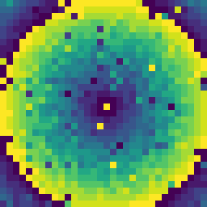
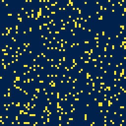

# Quantum Doodles
Little visualisations using quantum-related programs. 

# Examples

## QPE Pattern

This is a pattern created using the quantum phase estimation algorithm. We give the algorithm an operator with the solution proportional to the pixel's distance from the center, the algorithm returns this value with high (but not 100%) probability (hence the noise).

## Game of Life Style Pattern

Each pixel takes as input the 9 pixels surrounding it. A quantum circuit is then used to calculate whether that pixel is 'on' or 'off'. I tried to emulate the conditions of Conway's game of life by making the probability of being on peak at around 4 nieghbouring pixels being 'on' and fall off with more, but I found getting results that did not die off instantly or grow uncontrollably relied on a careful balance of this probability and initial conditions.

